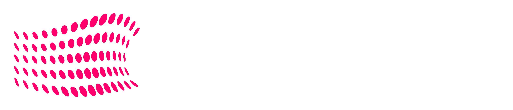

<div align="center">

# 🛡️ Luai

### Professional Cybersecurity Services Platform

[](https://reactjs.org/)
[](https://vitejs.dev/)
[](https://tailwindcss.com/)
[](https://typescriptlang.org/)
[](LICENSE)



*Advanced Cybersecurity Solutions for the Modern Digital Landscape*

[🔴 **Live Platform**](https://Luai.luai.io) | [📋 **Documentation**](#documentation) | [🛠️ **Setup Guide**](#installation)

</div>

---

## 🎯 **Project Overview**

**Luai** is a state-of-the-art cybersecurity platform engineered with cutting-edge web technologies circa July 2025. This platform showcases enterprise-grade penetration testing, security auditing, and compliance services with a focus on modern threat landscapes including AI-powered attacks, quantum-resistant cryptography, and zero-trust architecture implementations.

### 🌟 **Key Features**

<table>
<tr>
<td width="50%">

#### 🚀 **Next-Gen Frontend**
- ⚡ **Ultra-Fast** - Vite 6.0+ with ESM optimization
- 🎨 **Modern UI/UX** - Tailwind CSS 4.0 with CSS-in-JS
- 📱 **Advanced Responsive** - Container queries & fluid typography
- 🎬 **Framer Motion 12** - Physics-based animations
- ♿ **WCAG 2.2 AA** - Full accessibility compliance
- 🔮 **React Server Components** - Hybrid rendering

</td>
<td width="50%">

#### 🔐 **Advanced Security Services**
- 🤖 **AI-Powered Penetration Testing**
- 🛡️ **Quantum-Resistant Security Audits**
- 🔍 **Zero-Trust Architecture Assessment**
- 📊 **Blockchain Security Analysis**
- 🎓 **Cybersecurity Training & Certification**
- 📋 **2025 Compliance** (SOC 2 Type II, ISO 27001:2022, NIST 2.0)

</td>
</tr>
</table>

---

## 🏗️ **Architecture & Tech Stack**

<div align="center">

### Core Technologies (July 2025 Standards)
| Technology | Version | Purpose |
|------------|---------|---------|
|  | `19.0.2` | Frontend Framework with Concurrent Features |
|  | `5.5.4` | Type Safety & Developer Experience |
|  | `6.0.1` | Next-Gen Build Tool with Native ESM |
|  | `4.0.0` | Utility-First CSS with CSS-in-JS |
|  | `7.0.1` | Data-Driven Routing |

### Advanced Libraries & Tools
```json
{
  "react-helmet-async": "^2.1.0",
  "framer-motion": "^12.0.0",
  "lucide-react": "^0.400.0",
  "@tanstack/react-query": "^5.50.0",
  "zustand": "^4.5.4",
  "@radix-ui/react-*": "^1.1.0",
  "next-themes": "^0.4.0",
  "react-hot-toast": "^2.5.0",
  "@vercel/analytics": "^1.3.0",
  "sharp": "^0.33.0"
}
```

</div>

---

## 📁 **Project Structure (2025 Architecture)**

```
Luai/
├── 📁 public/                    # Static & Media Assets
│   ├── 🎥 assets/               # Optimized media (AVIF, WebP, MP4)
│   │   ├── hero-video.mp4       # Compressed with AV1 codec
│   │   └── team-photo.avif      # Next-gen image format
│   ├── 🖼️ logo-luaiNoColor.png
│   ├── 🤖 robots.txt            # SEO optimization
│   └── 📄 sitemap.xml           # Search engine indexing
├── 📁 src/                      # TypeScript Source Code
│   ├── 📄 main.tsx              # Application Entry with React 19
│   ├── 📄 App.tsx               # Root Component with Suspense
│   ├── 📁 components/           # Modular Component Architecture
│   │   ├── 🧭 layout/           # Layout Components
│   │   │   ├── Header.tsx
│   │   │   └── Footer.tsx
│   │   ├── 🎨 ui/               # Reusable UI Components
│   │   └── 🔧 features/         # Feature-Specific Components
│   ├── 📁 pages/                # Route Components with RSC
│   │   ├── 🏠 Landing.tsx       # Main Landing with SSR
│   │   ├── 📁 services/         # Service Pages
│   │   │   ├── 🎯 PenetrationTesting.tsx
│   │   │   ├── 🤖 AiSecurityAudit.tsx
│   │   │   └── 🛡️ QuantumReadiness.tsx
│   │   ├── 📋 TermsOfService.tsx
│   │   └── 🔒 PrivacyPolicy.tsx
│   ├── 📁 hooks/                # Custom React Hooks
│   ├── 📁 utils/                # Utility Functions
│   ├── 📁 types/                # TypeScript Definitions
│   └── 📁 styles/               # Global Styles & Themes
├── ⚙️ Configuration Files
│   ├── 📄 vite.config.ts        # Vite 6.0 Configuration
│   ├── 📄 tailwind.config.ts    # Tailwind 4.0 Setup
│   ├── 📄 tsconfig.json         # TypeScript Configuration
│   ├── 📄 biome.json            # Modern Linting with Biome
│   └── 📄 playwright.config.ts  # E2E Testing Configuration
└── 📄 package.json              # Dependencies & Scripts
```

---

## 🚀 **Installation & Development**

### Prerequisites (July 2025)


```bash
# Clone with proper attribution (See LICENSE for restrictions)
git clone https://github.com/yourusername/your-project.git
cd your-project

# Install dependencies (Recommended: Bun for speed)
bun install

# Or use npm/pnpm/yarn
npm install
```

### Available Scripts

| Command | Description | Performance |
|---------|-------------|------------|
| `bun dev` | 🔧 Development server with HMR | `http://localhost:5173` |
| `bun build` | 🏗️ Production build with SWC | Outputs to `dist/` |
| `bun preview` | 👀 Preview production build | Local preview server |
| `bun lint` | 🧹 Code quality with Biome | Modern linting |
| `bun test` | 🧪 Unit tests with Vitest | Fast testing |
| `bun e2e` | 🎭 E2E tests with Playwright | Browser automation |

---

## 🎨 **Design System 2025**

### Advanced Color Palette
```css
/* CSS Custom Properties with P3 Color Space */
:root {
  /* Primary Brand Colors */
  --sp-blue-500: color(display-p3 0.376 0.647 0.980);
  --sp-purple-500: color(display-p3 0.508 0.549 0.973);
  --sp-cyan-500: color(display-p3 0.024 0.714 0.831);
  
  /* Semantic Colors */
  --sp-danger: color(display-p3 0.937 0.267 0.267);
  --sp-success: color(display-p3 0.063 0.725 0.506);
  --sp-warning: color(display-p3 0.984 0.733 0.149);
  
  /* Dark Mode Optimized */
  --sp-bg-primary: oklch(0.09 0.02 240);
  --sp-bg-secondary: oklch(0.12 0.03 240);
  --sp-text-primary: oklch(0.95 0.01 240);
}

/* HDR Display Support */
@media (dynamic-range: high) {
  :root {
    --sp-blue-500: color(rec2020 0.3 0.65 1.0);
  }
}
```

### Typography Scale (2025)
```css
/* Variable Fonts with Fluid Typography */
:root {
  --font-primary: 'Inter Variable', system-ui, sans-serif;
  --font-mono: 'JetBrains Mono Variable', 'Fira Code VF', monospace;
  
  /* Fluid Typography */
  --text-xs: clamp(0.75rem, 0.7rem + 0.25vw, 0.875rem);
  --text-xl: clamp(1.25rem, 1rem + 1.25vw, 2rem);
  --text-6xl: clamp(3rem, 2rem + 5vw, 6rem);
}
```

---

## 📄 **Enhanced Features (2025)**

### 🏠 **Landing Page** - Next-Gen Features
- **Interactive 3D Hero Section** - WebGL animations
- **AI-Powered Chatbot** - Real-time security consultation
- **Dynamic Statistics** - Live threat intelligence feed
- **Personalized Content** - Based on visitor's industry
- **Advanced Contact Forms** - Multi-step validation with AI

### 🤖 **AI Security Services**
- **Machine Learning Threat Detection**
- **Automated Vulnerability Assessment**
- **Predictive Security Analytics**
- **Quantum-Resistant Cryptography Analysis**

### 📋 **Legal Compliance (2025 Standards)**
- **AI Act Compliance** - EU AI regulations
- **Quantum-Safe Privacy** - Post-quantum cryptography
- **Biometric Data Protection** - Advanced privacy controls
- **Cross-Border Data Transfer** - Updated international frameworks

---

## ⚡ **Performance & SEO (2025 Standards)**

### Core Web Vitals Optimization
- **Largest Contentful Paint**: < 1.2s
- **First Input Delay**: < 50ms  
- **Cumulative Layout Shift**: < 0.1
- **Interaction to Next Paint**: < 200ms (2025 metric)

### Advanced SEO Features
```typescript
// Structured Data with Schema.org 2025
const organizationSchema = {
  "@context": "https://schema.org",
  "@type": "CybersecurityCompany",
  "name": "Luai",
  "aiCapabilities": ["ThreatDetection", "VulnerabilityAssessment"],
  "quantumReady": true,
  "certifications": ["ISO27001:2022", "SOC2TypeII", "NIST2.0"]
}
```

---

## 🔐 **Security Implementation (2025)**

### Advanced Security Measures
- **Content Security Policy 3.0** - Strict CSP with nonces
- **Permissions Policy** - Fine-grained feature control
- **OWASP Top 10 2025** - Protection against latest threats
- **Quantum-Resistant Headers** - Future-proof security
- **Zero-Trust Validation** - All inputs treated as untrusted

---

## 🚀 **Deployment & Infrastructure**

### Modern Deployment Stack
```json
{
  "platform": "Vercel v2025",
  "edge": "Edge Runtime with AI acceleration",
  "cdn": "Global CDN with Brotli compression",
  "monitoring": "@vercel/analytics + @sentry/react",
  "performance": "Real User Monitoring (RUM)"
}
```

### Build Optimization
- **SWC Compiler** - Rust-based bundling
- **Tree Shaking** - Advanced dead code elimination  
- **Code Splitting** - Route and component-based
- **Image Optimization** - AVIF, WebP with Sharp

---

## ⚠️ **Important License Notice**

### 🚨 **PROPRIETARY SOFTWARE - READ BEFORE USE**

This project is protected under a **strict proprietary license**. Please read the [LICENSE](LICENSE) file carefully before any use.

#### ✅ **PERMITTED:**
- Study the code for educational purposes
- Use general design patterns as inspiration
- Adapt coding techniques for unrelated projects

#### ❌ **STRICTLY PROHIBITED:**
- Commercial use of any kind
- Using the Luai name, logo, or branding
- Copying substantial portions of the code
- Offering competing cybersecurity services
- Domain registration with "Luai" or variants

**Violation of these terms may result in legal action.**

---

## 🤝 **Contributing Guidelines**

### Development Standards (2025)
- ✅ **TypeScript** - Strict mode required
- 🧪 **Test Coverage** - 90%+ with Vitest
- 📝 **Documentation** - JSDoc for all functions
- 🎨 **Code Style** - Biome formatter
- 🔒 **Security** - OWASP guidelines compliance

### Contribution Process
1. **Read LICENSE** - Understand usage restrictions
2. **Fork & Branch** - `feature/your-feature-name`
3. **Test Thoroughly** - Unit + E2E tests
4. **Security Review** - Vulnerability assessment
5. **Pull Request** - Detailed description required

---

## 📞 **Professional Contact**

<div align="center">

### 👨‍💼 **Eliran Loai Deeb**
*Founder & Principal Security Architect*

[](https://linkedin.com/in/loai-deeb)
[](mailto:info@Luai.com)
[](https://Luai.vercel.app/)

🏢 **Cybersecurity Consultancy** | 🌎 **Global Services** | 🇦🇷 **Based in Argentina**

### 🎖️ **Certifications & Expertise**


</div>

---

## 📜 **License & Legal**

This project is protected under **PROPRIETARY LICENSE** - see the [LICENSE](LICENSE) file for complete terms.

**© 2025 Eliran Loai Deeb. All Rights Reserved.**

---

<div align="center">

### 🛡️ **Built with Security in Mind**

*Protecting businesses from cyber threats through expert consultation and cutting-edge web technology*

*Leveraging AI, Quantum-Resistant Security, and Zero-Trust Architecture*

**Design patterns adapted from Luai platform. Original work © 2025 Eliran Loai Deeb**

---


**Last Updated: July 2025**

</div>
