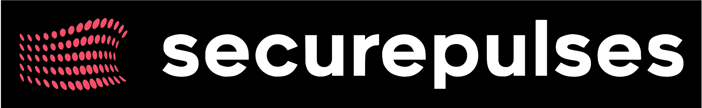

<div align="center">

# 🛡️ SecurePulses

### Professional Cybersecurity Services Platform

[](https://reactjs.org/)
[](https://vitejs.dev/)
[](https://tailwindcss.com/)
[](LICENSE)



*Protecting Your Digital Assets Before Hackers Find Them*

[🔴 **Live Demo**](https://securepulses.com) | [📋 **Documentation**](#documentation) | [🛠️ **Setup Guide**](#installation)

</div>

---

## 🎯 **Project Overview**

**SecurePulses** is a cutting-edge cybersecurity platform built with modern web technologies, designed to showcase professional penetration testing and security audit services. The platform combines stunning visual design with comprehensive cybersecurity content, targeting businesses that need robust security solutions.

### 🌟 **Key Features**

<table>
<tr>
<td width="50%">

#### 🚀 **Frontend Excellence**
- ⚡ **Lightning Fast** - Vite-powered development
- 🎨 **Modern UI/UX** - Tailwind CSS styling
- 📱 **Fully Responsive** - Mobile-first design
- 🎬 **Interactive Animations** - Engaging user experience
- ♿ **Accessibility** - WCAG compliant

</td>
<td width="50%">

#### 🔐 **Security Focus**
- 🛡️ **Penetration Testing Services**
- 🔍 **Vulnerability Assessments**
- 📊 **Security Audits**
- 🎓 **Educational Content**
- 📋 **Compliance Standards** (GDPR, CCPA, ISO 27001)

</td>
</tr>
</table>

---

## 🏗️ **Architecture & Tech Stack**

<div align="center">

### Core Technologies
| Technology | Version | Purpose |
|------------|---------|---------|
|  | `18.2.0` | Frontend Framework |
|  | `5.0.8` | Build Tool & Dev Server |
|  | `3.4.1` | CSS Framework |
|  | `6.8.1` | Client-side Routing |

### Additional Libraries
```json
{
  "react-helmet-async": "^2.0.4",      // SEO & Meta Management
  "react-countup": "^6.4.2",          // Animated Counters
  "lucide-react": "^0.263.1",         // Modern Icons
  "framer-motion": "^10.16.4"         // Advanced Animations
}
```

</div>

---

## 📁 **Project Structure**

```
SecurePulses/
├── 📁 public/                    # Static Assets
│   ├── 🎥 assets/               # Media files (videos, images)
│   │   ├── 0_Abstract_Design_Data_Visualization_3840x2160.mp4
│   │   └── IMG_9710.jpg
│   ├── 🖼️ securepulses-logo.svg
│   └── 🎨 *.png                 # Brand assets
├── 📁 src/                      # Source Code
│   ├── 📄 main.jsx              # Application Entry Point
│   ├── 📄 App.jsx               # Root Component
│   ├── 📁 components/           # Reusable Components
│   │   ├── 🧭 Header.jsx
│   │   ├── 🦶 Footer.jsx
│   │   └── 🎨 UI Components
│   ├── 📁 pages/                # Route Components
│   │   ├── 🏠 Landing.jsx       # Main Landing Page
│   │   ├── 📁 services/         # Service Pages
│   │   │   └── 🎯 PenetrationTesting.jsx
│   │   ├── 📋 TermsOfService.jsx
│   │   └── 🔒 PrivacyPolicy.jsx
│   └── 📁 styles/               # Custom Styles
├── ⚙️ Configuration Files
│   ├── 📄 vite.config.js        # Vite Configuration
│   ├── 📄 tailwind.config.js    # Tailwind Setup
│   ├── 📄 postcss.config.js     # PostCSS Configuration
│   └── 📄 eslint.config.js      # Code Quality Rules
└── 📄 package.json              # Dependencies & Scripts
```

---

## 🚀 **Installation**

### Prerequisites


### Available Scripts

| Command | Description | Usage |
|---------|-------------|-------|
| `npm run dev` | 🔧 Development server | `http://localhost:5173` |
| `npm run build` | 🏗️ Production build | Outputs to `dist/` |
| `npm run preview` | 👀 Preview production build | Test build locally |
| `npm run lint` | 🧹 Code quality check | ESLint validation |

---

## 🎨 **Design System**

### Color Palette
```css
/* Primary Colors */
--primary-blue: #60A5FA;      /* Interactive elements */
--primary-purple: #818CF8;    /* Accents & highlights */
--danger-red: #EF4444;        /* Alerts & warnings */
--success-green: #10B981;     /* Success states */

/* Background Gradients */
--bg-primary: #0F172A;        /* Main background */
--bg-secondary: #1E293B;      /* Card backgrounds */
--bg-accent: #334155;         /* Elevated surfaces */

/* Text Hierarchy */
--text-primary: #FFFFFF;      /* Headlines */
--text-secondary: #E2E8F0;    /* Body text */
--text-muted: #94A3B8;        /* Supporting text */
```

### Typography
- **Headers**: System fonts with bold weights
- **Body**: Clean, readable sans-serif
- **Code**: `'Fira Code'`, `'Source Code Pro'`, `'IBM Plex Mono'`

### Component Examples
```jsx
// Gradient Buttons
<button className="bg-gradient-to-r from-blue-600 to-purple-600 
                   rounded-xl shadow-lg hover:shadow-xl 
                   transform hover:scale-105 transition-all duration-300">
  Get Security Assessment
</button>

// Info Cards
<div className="bg-slate-800/50 backdrop-blur-sm border border-slate-700/50 
                rounded-2xl p-8 shadow-2xl hover:bg-slate-800/70 
                transition-all duration-300">
  <!-- Card content -->
</div>
```

---

## 📄 **Pages & Features**

### 🏠 **Landing Page** ([`src/pages/Landing.jsx`](src/pages/Landing.jsx))
- **Hero Section** - Compelling cybersecurity messaging
- **Services Overview** - Penetration testing, audits, assessments
- **Statistics & Social Proof** - Industry data and testimonials
- **Contact Form** - Lead generation with validation
- **Certifications Showcase** - Professional credentials

### 🎯 **Penetration Testing** ([`src/pages/services/PenetrationTesting.jsx`](src/pages/services/PenetrationTesting.jsx))
- Detailed service breakdown
- Methodology explanation
- Pricing and packages
- Case studies and results

### 📋 **Legal Pages**
- **Terms of Service** ([`src/pages/TermsOfService.jsx`](src/pages/TermsOfService.jsx)) - Multi-jurisdictional compliance
- **Privacy Policy** ([`src/pages/PrivacyPolicy.jsx`](src/pages/PrivacyPolicy.jsx)) - GDPR, CCPA compliant

---

## 🔧 **Configuration**

### Vite Configuration ([`vite.config.js`](vite.config.js))
```javascript
import { defineConfig } from 'vite'
import react from '@vitejs/plugin-react'

export default defineConfig({
  plugins: [react()],
  server: {
    port: 5173,
    open: true
  },
  build: {
    outDir: 'dist',
    sourcemap: true
  }
})
```

### Tailwind Setup ([`tailwind.config.js`](tailwind.config.js))
- Custom color extensions
- Animation utilities
- Component classes
- Responsive breakpoints

---

## 🌐 **Deployment**

### Vercel Deployment
The project is configured for seamless Vercel deployment with [`vercel.json`](vercel.json):

```json
{
  "framework": "vite",
  "buildCommand": "npm run build",
  "outputDirectory": "dist",
  "rewrites": [
    { "source": "/(.*)", "destination": "/index.html" }
  ]
}
```

### Build Process
1. **Development** → `npm run dev` 
2. **Testing** → `npm run lint`
3. **Building** → `npm run build`
4. **Deployment** → Automatic via Vercel

---

## 🔐 **Security Features**

- **Input Sanitization** - XSS protection in forms
- **HTTPS Enforcement** - Secure data transmission
- **Content Security Policy** - XSS prevention
- **Privacy Compliance** - GDPR, CCPA ready
- **Form Validation** - Client & server-side validation

---

## 📊 **SEO & Performance**

### SEO Optimization
- **Meta Tags** - Comprehensive social media tags
- **Structured Data** - Schema.org markup
- **Sitemap** - Search engine indexing
- **Canonical URLs** - Duplicate content prevention

### Performance Features
- **Lazy Loading** - Images and components
- **Code Splitting** - Route-based chunks
- **Asset Optimization** - Minimized bundles
- **Caching Strategy** - Browser and CDN caching

---

## 🤝 **Contributing**

### Development Guidelines

1. **Fork the repository**
2. **Create feature branch**: `git checkout -b feature/amazing-feature`
3. **Commit changes**: `git commit -m 'Add amazing feature'`
4. **Push to branch**: `git push origin feature/amazing-feature`
5. **Open Pull Request**

### Code Standards
- ✅ **ESLint** compliance required
- 📝 **Component documentation**
- 🧪 **Test coverage** for new features
- 🎨 **Consistent styling** with Tailwind

---

## 📞 **Contact & Support**

<div align="center">

### 👨‍💼 **Eliran Loai Deeb**
*Founder & Lead Security Consultant*

[](https://linkedin.com/in/eliran-loai-deeb)
[](mailto:info@securepulses.com)
[](https://securepulses.com)

📍 **Based in Israel** | 🌍 **Serving Globally**

</div>

---

## 📜 **License**

This project is licensed under the **MIT License** - see the [LICENSE](LICENSE) file for details.

---

<div align="center">

### 🛡️ **Built with Security in Mind**

*Protecting businesses from cyber threats through expert consultation and cutting-edge web technology*

**[⭐ Star this repository](https://github.com/tinkerlev/SecurePulses)** if you find it helpful!

---


</div>
